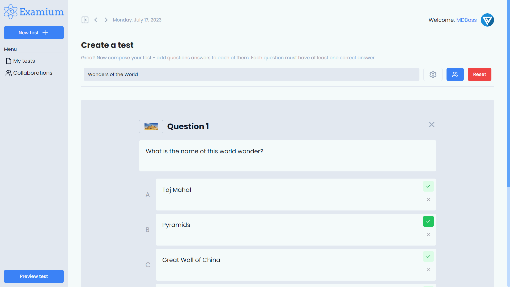
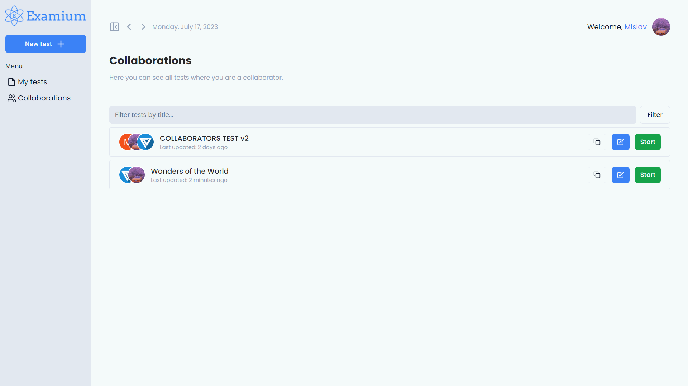
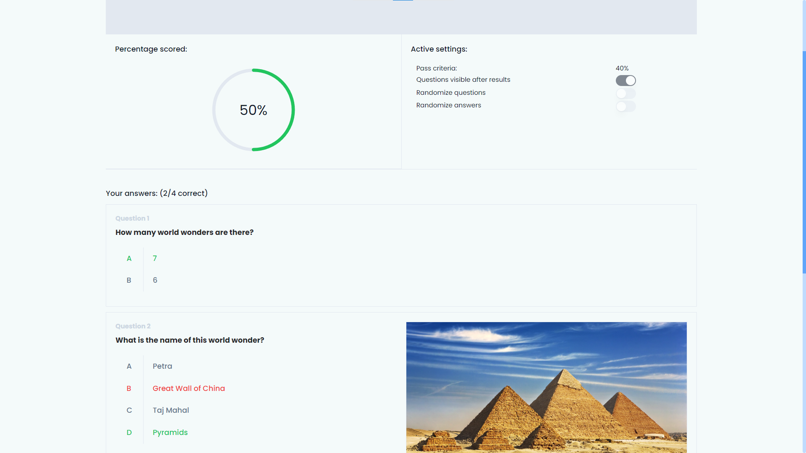

 

  

  <h3 align="center">Examium</h3>

  

    Collaborative quiz maker app built with React.js, Express.js, Prisma and MySQL.
     
     
    <a href="https://github.com/MDBossss/examium/issues">Report Bug</a>
    .
    <a href="https://github.com/MDBossss/examium/issues">Request Feature</a>
  

   

---

This is a work in progress project I started as a way to introduce myself to Prisma and using it with a Express.js backend. Currently the essential features are implemented, CRUD of the tests with the db, collaborating with other users, user auth... 

Feel free to contribute to the project as this is just a beginning, and has plenty of room for improvements, and of course, if you like the project, leave a star :)
